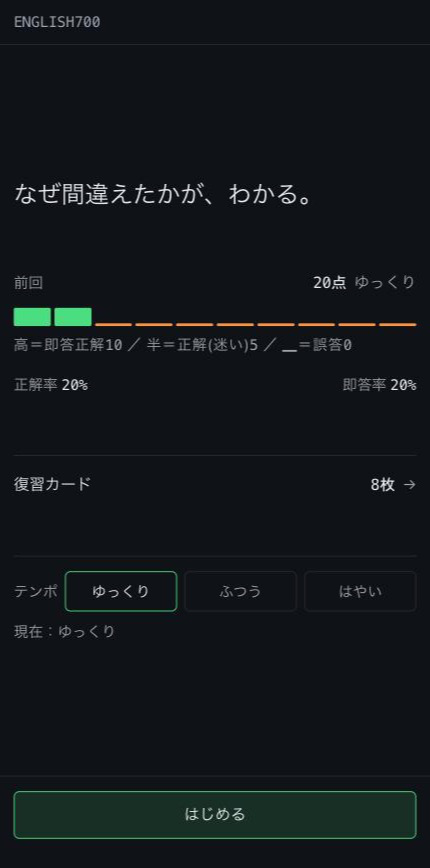
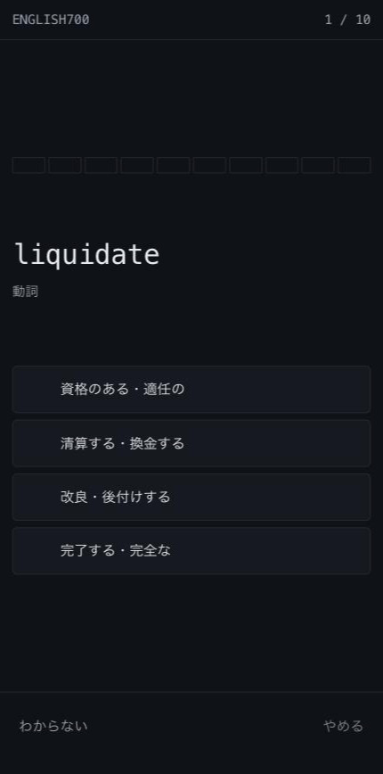
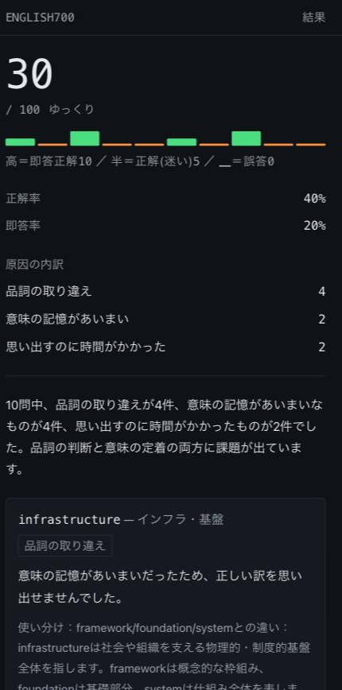
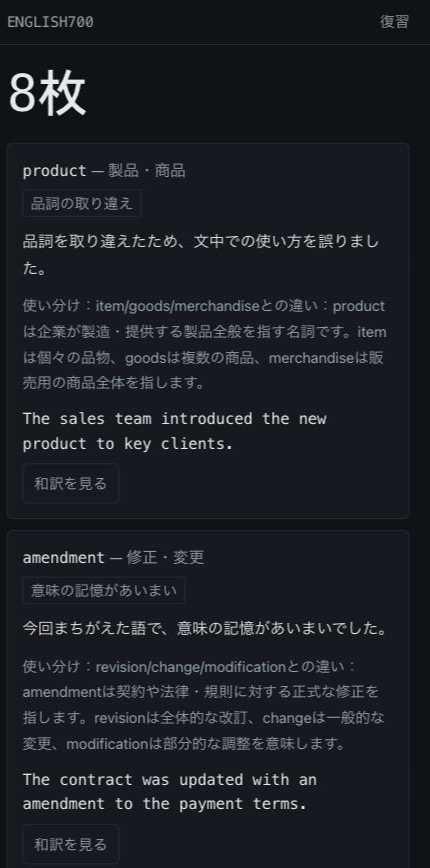

# ENGLISH700

なぜ間違えたかが、わかる。

TOEIC700点を目指す社会人向けの英単語アプリです。4択に答えると、その結果から
**なぜ間違えたか**を3種類に分類し、原因ごとの説明を返します。

DMM生成AI CAMP 卒業制作。

**本番URL：https://english-toeic700-app.vercel.app**

---

## 1. このアプリは何か

10問の4択に答えると、1問ごとの結果が3つのいずれかに分類されます。

| 原因 | 判定条件 |
|---|---|
| 品詞の取り違え | 出題語と品詞の異なる選択肢を選んだ |
| 意味の記憶があいまい | 同じ品詞の別の意味を選んだ、または無回答 |
| 思い出すのに時間がかかった | 正解したが、即答の閾値を超えた |

分類はアプリ側で確定させ、**AI には「なぜその原因になったか」の説明だけを書かせます。**
AI に原因を推測させると、同じ誤りが呼び出しごとに別の原因として説明されるためです。

### 画面

| 画面 | 内容 |
|---|---|
| ホーム | 前回のスコアと目盛り、正解率・即答率、復習カード枚数、テンポ設定 |
| 出題 | 進捗の目盛り、出題語、4択、「わからない」「やめる」 |
| 結果 | SCORE、目盛り、正解率・即答率、原因の内訳、AI の分析と復習カード |
| 復習 | 復習カードの一覧。読むだけ |

| ホーム | 出題 |
|---|---|
|  |  |

| 結果 | 復習 |
|---|---|
|  |  |

---

## 2. 既存アプリとの違い

主要な英単語アプリは「量とスピード」「教材の豊富さ」「忘却曲線による出題間隔」
「継続・ゲーム性」で競っています。間違えた語を記録して再出題するアプリはありますが、
**「なぜ間違えたか」を分類するアプリは、調べた範囲では見当たりませんでした。**

このアプリは応答時間をミリ秒で測り、**正解であっても「即答」と「迷い」を区別します。**

- 即答で正解した語は、その場で復習対象から外れます（卒業）
- 正解でも閾値を超えた語は「思い出すのに時間がかかった」として復習カードになります
- 得点も 10点 / 5点 / 0点 の3段階で、正解の中に差を付けています

「正解したかどうか」だけを見ていると、この差は記録に残りません。

---

## 3. 設計上の判断

**このアプリで一番時間をかけたのはコードではなく、判断とその記録です。**
判断の全文は `docs/decisions.md`、仕様の正典は `docs/spec.md` にあります。
ここでは主要なものを、**何を捨てたか**まで含めて書きます。

### 3-1. 目盛り（ScoreStrip）を署名要素にした

10問を10本の縦棒で表します。高さが得点、色が正誤です。

```
▇▇▅▇▇▁▅▇▇▇   高＝即答正解10 ／ 半＝正解(迷い)5 ／ ▁＝誤答0
```

**この目盛りの合計が SCORE そのものです。** 20px / 10px / 3px は §7-2 の 10点 / 5点 / 0点を
そのまま高さにしたもので、飾りではなく SCORE の内訳を1行で表した図です。
だから SCORE の直下に置いています。

同じ部品を出題中の進捗表示にも使い、**進捗バーを別に作っていません。**
左から立っていくので、進捗と得点が同じ形で表されます。

**捨てたもの**：凝る場所を1箇所に絞ったため、他の画面装飾は最低限です。
影を一切使わず、面の分離は 1px の罫線だけで行っています。

### 3-2. AI 由来のものはアプリ側計算より下に置く

本番のレイテンシは**4回中2回が25秒を超えました**（21.47 / 23.09 / 26.40 / 28.34 秒）。
「たまに遅い」ではなく「半分以上が超える」が実態です。

そこで結果画面を、上から SCORE → 目盛り → 正解率・即答率 → 原因の内訳 →
**区切り線** → ここから下が AI 由来、という並びに固定しました。
スマホの1画面には原因の内訳までしか入らないため、**28秒後にカードが到着しても、
読んでいる位置より下でしか変化が起きません。**

これを規約ではなく**構造で守っています。** SCORE と原因の内訳を描くコンポーネントは、
AI の状態を prop として受け取れません。受け取れないので、混ぜようとすると型エラーになります。

```
<Readout … />      SCORE・目盛り・率（ai を受け取れない）
<CauseTable … />   原因の内訳（ai を受け取れない）
<hr />             ここから下が AI 由来
<AiSlot ai={ai} /> AI 由来はこの中だけ
```

待機中と到着後で**画面を切り替えていません。** 同じレイアウトのまま、AI 由来の枠の中身だけが
「分析中…」から本文に変わります。切り替えると「待たされた」という体験が生まれるためです。

**捨てたもの**：待機中にスピナーを置いていません。SCORE と内訳を読んでもらう時間なので、
視線を奪うものを置かないという判断です。

### 3-3. タイマーを置かない

即答判定の閾値とは別に、60秒を超えた回答は無回答として扱います。
ただし**カウントダウンも自動遷移も置いていません。**

利用シーンが通勤電車と昼休みだからです。電車を降りて画面を伏せた人の問題を、
時間切れで勝手に閉じてしまう作りは、「通勤中の中断を誤答にしない」という前提と
正面から衝突します。60秒は**回答した瞬間の経過時間に適用する上限**であり、
タイマーではありません。

同じ理由で、「わからない」ボタンは誤答ではなく**無回答**を作ります。

### 3-4. 色の意味づけを実機で見てから変えた

当初、目盛りの色は「復習対象かどうか」を表していました。正解でも迷った語は復習対象なので
橙になる設計です。**実機で見て変えました。**

緑と橙の対比は凡例を読まなくても届きます。であれば、色は**正誤の二値**に使い切り、
迷ったかどうかという細かい差は**高さ**に担わせたほうが読めます。
色で正誤、高さで精度、という二層にしました。

**捨てたもの**：目盛りだけでは復習対象の総数が読めなくなりました（橙が立つのは誤答のみ）。
ホームの「復習カード ◯枚」の行がその数を持つので情報自体は失われませんが、
**読み取りが2箇所に分かれます。** この代償を承知のうえで採っています。

実機で変えた判断は他にもあります。ドックの余白（16px では iOS のツールバーと接して窮屈だった）、
復習カードの見出しと原因タグの配置（横並びだと長い語が途中で折れて関係が読めない）、
読む領域の高さの上限（横幅を480pxで止めたのと同じことを縦にもした）。

### 3-5. モデルは実測して選んだ

Sonnet 5 と Haiku 4.5 を、**モデル以外の条件をすべて揃えて**比較しました。
同一ペイロード・同一コード・同一環境・各1回。詳細は `docs/data-findings.md` §9。

| 項目 | Sonnet 5 | Haiku 4.5 |
|---|---|---|
| 応答時間 | 13.81秒 | 13.40秒 |
| 応答JSON 全体 | 990字 | 864字 |
| 復習カード | 2枚（id とも正しい） | 2枚（id とも正しい） |

**Sonnet 5 を採りました。** 理由は速度が変わらなかったことです。0.4秒差は誤差の範囲で、
Haiku に替える最大の動機が成立しませんでした。速度が同じであれば、質を落とす理由がありません。

質の差は使い分けの説明に出ました。`available` の類義語について、Sonnet 5 は
`accessible` を「到達可能性」、`obtainable` を「手続き面」と**軸を立てて**説明します。
Haiku 4.5 は括弧書きの訳語を添えるだけでした。このアプリの主張は原因分析なので、
使い分けの説明は中核にあたります。

**落とした側からも収穫がありました。** Sonnet 5 の説明文に「閾値の5000ms」と内部の単位が
出ていたのに対し、Haiku 4.5 は「5秒以内」と人間向けに変換していました。
プロンプトが `instantThresholdMs` をそのまま渡していたのが原因だったので、
秒に変換して渡すよう直しました。修正後、実 API の応答に `5000ms` / `ミリ秒` は0件です。

**この測定で見えないこと**：各1回のみで分散を見ていません。ローカル実測であり本番値ではありません。
入力は2問で、実運用の10問より小さいものです。

---

## 4. 技術構成

| 領域 | 採用 |
|---|---|
| フレームワーク | Next.js 16.3.1（App Router / Turbopack） |
| 言語 | TypeScript 5 |
| UI | React 19.2.8 / Tailwind CSS v4 |
| AI | Anthropic API（`claude-sonnet-5`）／`@anthropic-ai/sdk` 0.117.1 |
| テスト | Vitest 4.1.10 |
| ホスティング | Vercel |
| 保存 | localStorage（サーバーにユーザーデータを持たない） |

APIキーはサーバー側の Route Handler だけが読み、クライアントから
`api.anthropic.com` を直接呼ぶ経路はありません。

### テストする境界としない境界

**テスト164件（17ファイル）。すべて green。**

| テストする | テストしない |
|---|---|
| プロンプト組み立て関数（＝**何を渡しているか**） | LLM が返した**文章の中身** |
| 誤答選択肢の生成・原因の分類・セッションの組み立て | 画面の見た目 |
| AI 応答の検証層（幻覚チェック・文字数上限・件数制限） | |
| localStorage の読み書きとスキーマ検査 | |

**LLM の出力内容はテストしません。** 同じ入力でも文章は毎回変わるので、
点滅するテストになるためです。代わりに**入力**をテストします。

たとえばプロンプトのテストは「渡さないものが混入していないこと」を実際の文字列で検査します
（日付・localStorage 全体・セッション履歴）。原因の内部値やミリ秒表記が混ざっていないことも
ここで守っています。

AI の応答は検証層（V1〜V6）を通します。出題していない単語 id が返ってきたら**その応答ごと捨て**、
カードは説明なしのまま残します。誤った説明を見せるより、説明が1回遅れるほうが安いという判断です。

### 見えないもの（限界）

- セッション途中で離脱すると結果は消えます。出題状態を React の state だけで持つ設計の帰結です
- 即答の閾値 8 / 5 / 3秒は暫定値です。実機で調整した根拠をまだ持っていません
- 本番レイテンシの実測は2026-08-16 の4回のみです。同時アクセス時のばらつきは見ていません
- ホームの目盛りは本数だけの復元で、並び順を保持していません（1問ごとの結果を保存していないため）

---

## 5. 開発の進め方

**`docs/spec.md` を単一の正典としました。** 実装前に必ず読み、コードと食い違ったら
コードではなく spec を先に直します。判断の記録は `docs/decisions.md`、
配布データの実測値は `docs/data-findings.md` に分けています。

各ステップは `docs/prompts/stepN.md` で**着手前に判断を確定**させてから始めます。
実装中に判断が必要になった場合は、**実装せずに止まって報告する**運用にしました。
実際、STEP 6 では「AI 生成中に『もう1セット』を押したときの応答をどう扱うか」など
6件を着手前に確定させています。

コミットは段階ごとに分けています。

```
STEP 6 段階0: デザイントークンを globals.css に転記
STEP 6 段階1: platform 3本（clock / rng / storage）を追加
STEP 6 段階2: ScoreStrip を実装（署名要素）
STEP 6 段階3: 出題画面を実装
STEP 6 段階3: レイアウトを実機に合わせて調整
STEP 6 段階4-5: 結果画面・ホーム・/review を実装し、実機の指摘5件を修正
```

**実機で見て直した回数が多いのが特徴です。** レイアウトは3回作り直しています。
上寄せ、下寄せ、そして「塊に高さの上限を与えて中央に置く」で落ち着きました。
画面の見え方は動かすまで分からない、という前提で進めました。

---

## 6. 今後の構想

実装していません。記録として残しているものです（`docs/spec.md` §16）。

- **発音の再生**：出題語の横をタップすると発音が流れる。iOS Safari が初回タップまで
  音を出さないこと、通勤電車で音を出せない環境での振る舞い、差し色を増やさずに
  ボタンをどう見せるかが検討事項
- **AI 応答の分割**：現在は1回の呼び出しで pattern_summary・復習カード5枚・
  next_message をまとめて生成しています。分ければ体感待ち時間を縮められる可能性があります
- **ストリーミング**：現在はカードが5枚同時に到着します。1枚ずつ流すと検証層
  （出題していない id を弾く処理）が後追いになるため、いまは採っていません

---

## 開発

```bash
npm install
npm run dev

npm test              # Vitest
npx tsc --noEmit
npm run lint
npm run build
```

`.env.local` に以下が必要です（値はコミットしません）。

```
ANTHROPIC_API_KEY=
AI_MODEL=claude-sonnet-5
```

APIキーが未設定でもアプリは動きます。AI の分析だけが取得できず、
復習カードは説明なしのまま作られます。

---

## ドキュメント

| ファイル | 内容 |
|---|---|
| `docs/spec.md` | 仕様の正典。設計判断はすべてここに書き戻す |
| `docs/decisions.md` | 判断の索引。何を決め、何を捨てたか |
| `docs/data-findings.md` | 配布データとモデル比較の実測値 |
| `docs/進捗管理.md` | ステップごとの進捗と品質チェックの記録 |
| `docs/prompts/stepN.md` | 各ステップの着手前指示 |
